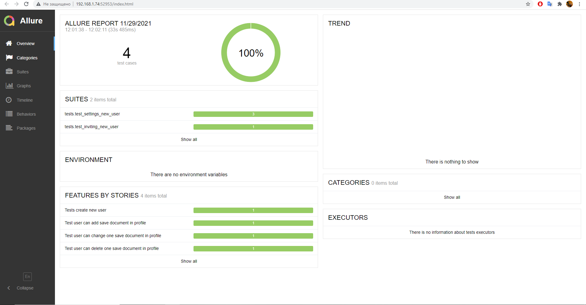

### Описание
Пример реализации проекта UI-тестов с помощью selenium + python, с отчётами в allure.

___
## Маркировки тестов
- smoke : smoke тесты 
- regress: регресс тесты 
- user: тесты для модуля Пользователи
___
## Настройка 
HOST='https://example.host.com/' -хост   
REMOTE_BROWSER_HOST=http://selenium_hub:4444/wd/hub - для запуска тестов на selenoid
TIMEOUT_WAIT_ELEMENT=10  - время ожидание элемента на странице
TIMEOUT_WAIT_ELEMENT_FOR_SCROLLER=3  - время ожидание элемента на странице для скролла
___
## Allure установка

https://www.youtube.com/watch?v=6qASwPL86MM    

___

### Пример отчёта по тест-кейсам.

 

### Параметры для запуска тестов  
- --headless - запуск тестов без окна браузера (По умолчанию запуск тестов с окном)
- --browser_name=g - браузер для запуска тестов. (По умолчанию Chrome)
- --host_name=https://uat.simple-solution.liis.su - хост с которым будут работать и запускаться тесты(По умолчанию UAT)
- --remote_browser - запуск тестов на удалённом браузере (Для Docker)
- --alluredir [DIR] - запуск тестов с составлением отчётов в стиле Allure Reports
### Команды для запуска
Запуск тестов локально с отчётом в стиле Allure Reports:

`python pytest --headless --browser_name=g -k='ID_U_I_001' --alluredir results_reports`  

Составление отчётов в стиле Allure

`allure serve [DIR]`

